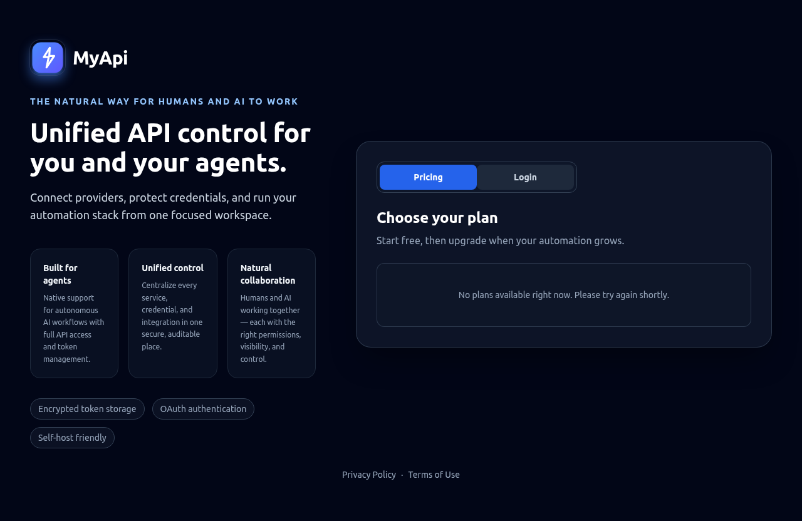
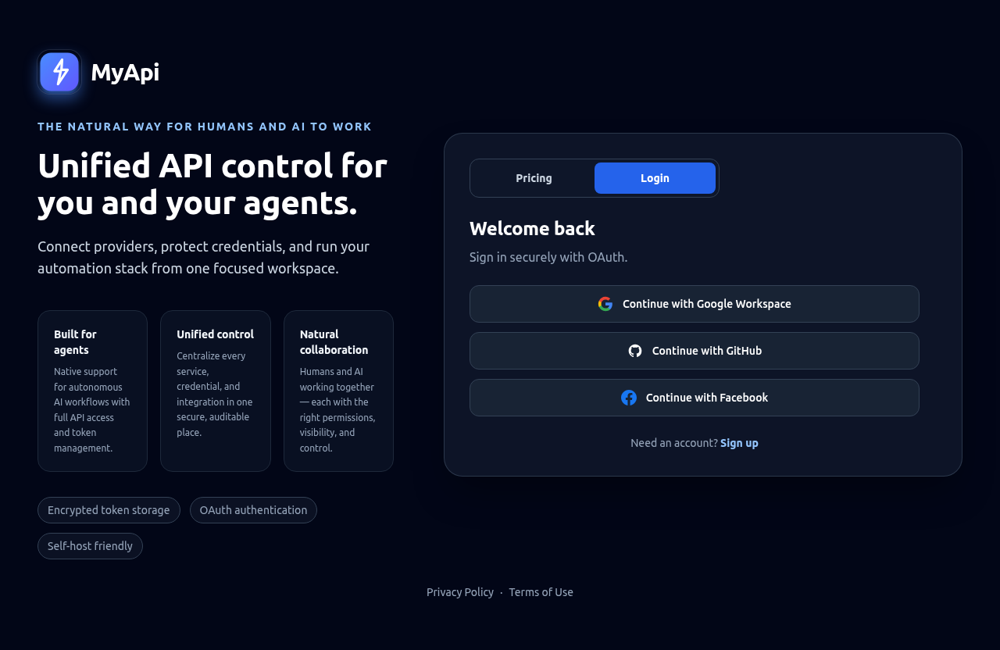

# MyApi-Open

<p align="center">
  
</p>

<p align="center">
  <strong>Your personal API layer for AI agents.</strong>
</p>

<p align="center">
  MyApi-Open is the open-source foundation of MyApi: a control plane that gives AI agents secure, structured access to identity, memory, knowledge, personas, skills, and connected services.
</p>

<p align="center">
  <a href="#quick-start">Quick Start</a> •
  <a href="#screenshots">Screenshots</a> •
  <a href="#core-features">Features</a> •
  <a href="#architecture">Architecture</a> •
  <a href="#documentation">Docs</a>
</p>

## Why MyApi-Open

Most AI workflows break down in the same place:
- context is scattered across chats, docs, and personal notes
- credentials get pasted into too many tools
- agent access is too broad or impossible to audit
- every new assistant has to be re-taught the same things from scratch

MyApi-Open solves that by giving agents a single, structured surface for:
- identity and profile context
- durable memory
- long-form knowledge
- personas and behavioral overlays
- reusable skills
- connected services and scoped execution
- audit-friendly access control

## Screenshots

### Landing page



A focused landing page built around secure agent workflows, connected services, and unified control.

### Login panel



OAuth-first sign-in flow with a clean public entry point for workspace access.

## Core Features

- **Identity and profile context**: Give agents grounded user context without repeating the same details every session.
- **Memory**: Store durable facts and preferences that should persist across conversations.
- **Knowledge base**: Attach long-form documents, runbooks, and notes that agents can use for deeper retrieval.
- **Personas**: Create role-specific modes with different tone, behavior, and attached context.
- **Skills**: Install and compose reusable capabilities for common tasks and workflows.
- **Services and connectors**: Connect external tools once and let agents operate through a unified API layer.
- **Scoped access**: Control what each token or agent is allowed to read or do.
- **Auditability**: Keep agent actions observable and easier to review.

## Architecture

MyApi-Open follows a decoupled architecture focused on security, portability, and extensibility:

- **Backend** (`/src/`): Node.js / Express gateway, OAuth proxy, API server, and SQLite-backed application layer.
- **Frontend dashboard** (`/src/public/dashboard-app/`): React + Vite single-page app styled with Tailwind CSS and powered by Zustand stores.
- **Documentation** (`/docs/`): Public docs, guides, manuals, and architecture references.

## Quick Start

### Prerequisites

- Node.js 18+
- npm or yarn

### Clone

```bash
git clone https://github.com/omribenami/MyApi-Open.git
cd MyApi-Open
```

### Install backend

```bash
cd src
npm install
```

### Install frontend

```bash
cd public/dashboard-app
npm install
```

### Run locally

Backend, from `src/`:

```bash
npm run dev
```

Frontend, from `src/public/dashboard-app/` in a second terminal:

```bash
npm run dev
```

Endpoints:

- API: `http://localhost:4500`
- Dashboard: `http://localhost:5173`

## Environment Setup

Create `src/.env` from the example:

```bash
cp src/.env.example src/.env
```

Important settings include:

```bash
PORT=4500
NODE_ENV=development
DB_PATH=./db.sqlite
SESSION_SECRET=<generate-a-secret>
ENCRYPTION_KEY=<generate-a-secret>
VAULT_KEY=<generate-a-secret>
JWT_SECRET=<generate-a-secret>
GOOGLE_CLIENT_ID=<your-google-client-id>
GOOGLE_CLIENT_SECRET=<your-google-client-secret>
GITHUB_CLIENT_ID=<your-github-client-id>
GITHUB_CLIENT_SECRET=<your-github-client-secret>
```

This repository does not ship live credentials. Configure provider secrets in your own environment before use.

## Docker

Development:

```bash
docker-compose -f docker-compose.dev.yml up --build
```

Production:

```bash
docker-compose -f docker-compose.prod.yml up -d --build
```

## Key API Areas

- `GET /api/v1/auth/me`
- `GET /api/v1/capabilities`
- `GET /openapi.json`
- `GET /api/v1/personas`
- `GET /api/v1/services`
- `GET /api/v1/memory`
- `GET /api/v1/brain/knowledge-base`
- `GET /api/v1/skills`
- `GET /api/v1/vault/tokens`

## Data Export

MyApi supports JSON and ZIP export flows for portable user data packaging.

Example JSON export:

```bash
curl -H "Authorization: Bearer ***" \
  "http://localhost:4500/api/v1/export?mode=portable&tokens=true"
```

Example ZIP export:

```bash
curl -L -H "Authorization: Bearer ***" \
  "http://localhost:4500/api/v1/export?format=zip&mode=portable&includeFiles=false" \
  -o myapi-export.zip
```

## Documentation

Useful starting points in `/docs`:

- [Design Summary](docs/DESIGN_SUMMARY.md)
- [UI Architecture](docs/UI_ARCHITECTURE.md)
- [Developer Quick Start](docs/DEVELOPER_QUICK_START.md)
- [Services Manual](docs/SERVICES_MANUAL.md)
- [Email Outbound](docs/EMAIL_OUTBOUND.md)
- [Export](docs/EXPORT.md)

## Repository Policy

This open repository is intended to contain only:
- source code
- public-safe documentation
- setup guides
- examples and manuals

Never commit:
- live `.env` files
- database files and WAL/SHM files
- uploaded user content
- export archives
- local agent/tooling state
- real API keys, OAuth secrets, tokens, or certificates
- internal planning, roadmap, status, or launch-tracking documents

## License

Licensed under the GNU Affero General Public License v3.0.
See [LICENSE](LICENSE).
